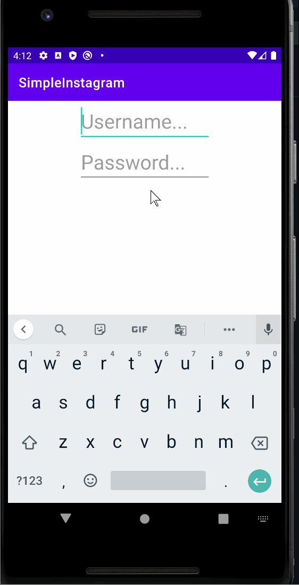
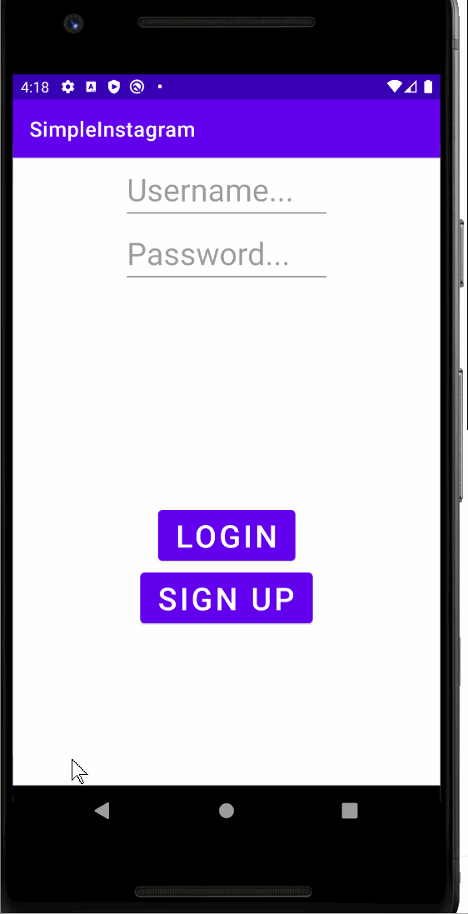
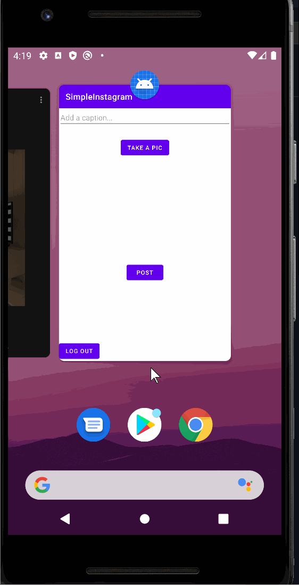
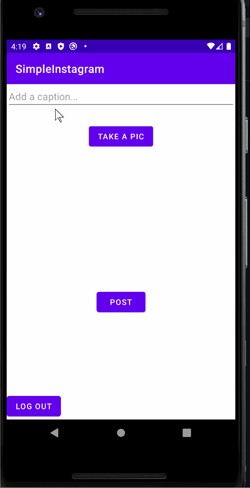

# Project 3 - *SimpleInstagram*

**SimpleInstagram** is a photo sharing app similar to Instagram but using Parse as its backend.

Time spent: **4** hours spent in total

## User Stories

The following **required** functionality is completed:

- [ ] User can sign up to create a new account using Parse authentication.
- [ ] User can log in and log out of his or her account.
- [ ] The current signed in user is persisted across app restarts.
- [ ] User can take a photo, add a caption, and post it to "Instagram".

## Video Walkthrough

Here's a walkthrough of implemented user stories:  

 

 

 

## Notes

Describe any challenges encountered while building the app.

## Open-source libraries used

- [Android Async HTTP](https://github.com/codepath/CPAsyncHttpClient) - Simple asynchronous HTTP requests with JSON parsing
- [Glide](https://github.com/bumptech/glide) - Image loading and caching library for Android

## License

    Copyright [yyyy] [name of copyright owner]

    Licensed under the Apache License, Version 2.0 (the "License");
    you may not use this file except in compliance with the License.
    You may obtain a copy of the License at

        http://www.apache.org/licenses/LICENSE-2.0

    Unless required by applicable law or agreed to in writing, software
    distributed under the License is distributed on an "AS IS" BASIS,
    WITHOUT WARRANTIES OR CONDITIONS OF ANY KIND, either express or implied.
    See the License for the specific language governing permissions and
    limitations under the License.
